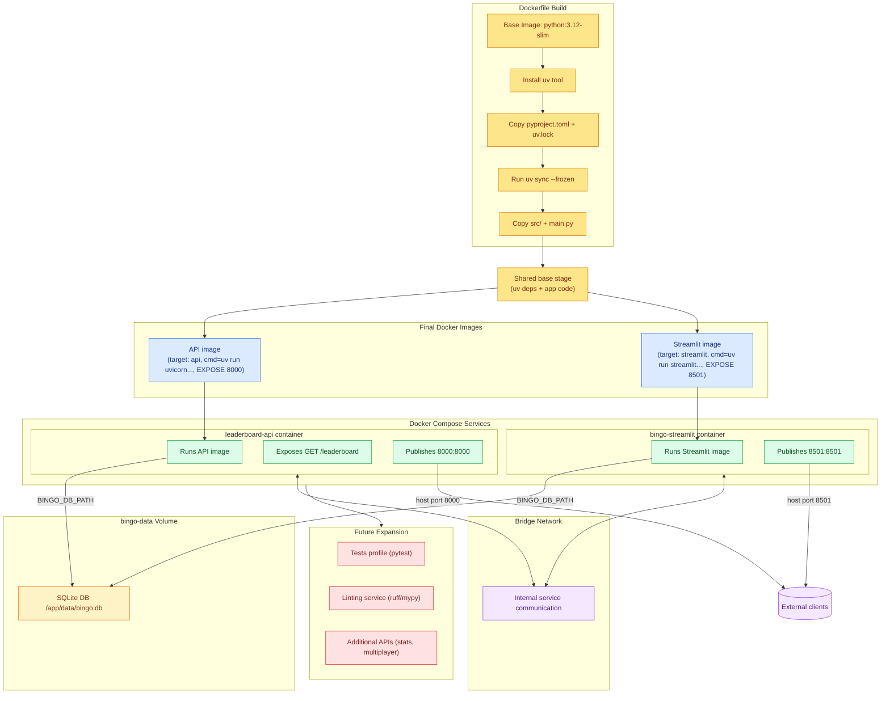

# Docker Deployment Plan

This document consolidates the early design for containerizing *My Project Bingo*.
It explains how we will build the Docker image, orchestrate multiple containers
with Docker Compose, and configure networking, volumes, and environment
variables. Although the plan may evolve, documenting it in one place keeps the
direction clear for future iterations.

## 1. Container Build Strategy (Dockerfile)
The Dockerfile defines a common **`base` stage** plus two distinct targets so we
can produce separate API and Streamlit images without duplicating steps:

1. **Base stage (`base`)** – starts from `python:3.12-slim`, sets `WORKDIR` to
   `/app`, installs `uv`, copies `pyproject.toml`, `uv.lock`, `README.md`, and
   `LICENSE.md`, then runs `uv sync --frozen --no-dev --no-install-project` to
   create the runtime environment before copying `src/` and `main.py`.
2. **API stage (`api`)** – `FROM base AS api`, `EXPOSE 8000`, and `CMD ["uv",
   "run", "uvicorn", "src.api.leaderboard:app", "--host", "0.0.0.0",
   "--port", "8000"]`. This target bakes in the HTTP entry point.
3. **Streamlit stage (`streamlit`)** – `FROM base AS streamlit`, `EXPOSE 8501`,
   and `CMD ["uv", "run", "streamlit", "run", "src/ui/streamlit_app.py", ...]`
   to publish the web UI.

Because the heavy lifting lives in the base stage, rebuilding either image reuses
cached layers and guarantees identical dependency sets.

## 2. Runtime Services (Docker Compose)
Compose now builds **two images** from the single Dockerfile by selecting the
appropriate target per service:

- **`leaderboard-api`**
  - Purpose: exposes a FastAPI app (`src.api.leaderboard:app`) backed by the
    same SQLite database for viewing stats via HTTP.
  - Image: `my-project-bingo-api` (built with `target: api`) which already runs
    `uv run uvicorn ... --port 8000`.
  - Ports: binds container port `8000` to host `8000` for browser access.
  - Environment: same `BINGO_DB_PATH` so records and API reads are consistent.

- **`bingo-streamlit`**
  - Purpose: publishes the Streamlit UI for playing/viewing bingo in the
    browser.
  - Image: `my-project-bingo-streamlit` (built with `target: streamlit`) which
    runs `uv run streamlit run src/ui/streamlit_app.py`.
  - Ports: binds container port `8501` to host `8501` for browser access.
  - Environment: shares `BINGO_DB_PATH` so it reads/writes the same SQLite DB.

- **Future `tests` profile (optional)**
  - Could reuse the image to launch `uv run pytest`. Keeping this as a profile
    prevents the container from starting automatically but documents how CI or
    developers can run the full suite inside Docker.

## 3. Networking, Volumes, and Environment
- **Network Topology** – Compose’s default bridge network is sufficient. The two
  services can talk internally if future features require it, while only the API
  publishes a port to the host.
- **Persistent Volume** – a named volume `bingo-data` is mounted at
  `/app/data` in every service. SQLite stores `bingo.db` there so both
  containers share the same persistence and data survives restarts. If we later
  replace SQLite with another backend, the volume mount points are the only
  change needed in Compose.
- **Environment Variables** – `BINGO_DB_PATH` standardizes how code discovers
  the database location. Additional knobs (e.g., logging levels, API limits)
  should be surfaced the same way so containers remain configuration-driven.
- **Resource Considerations** – even though we build two images, both inherit
  from the shared base stage so runtimes and dependencies stay perfectly in
  sync.

## 4. Detailed Deployment Topology
Before rendering the workflow, we spell out each responsibility:

- **Dockerfile pipeline** – base `python:3.12-slim`, install `uv`, copy
  dependency manifests, run `uv sync --frozen`, copy application code. Two
  final targets (`api`, `streamlit`) extend this base so we obtain separate
  runtime images without duplicating layers.
- **API image** – inherits from the base stage, exposes port `8000`, and runs
  `uv run uvicorn src.api.leaderboard:app --host 0.0.0.0 --port 8000`.
- **Streamlit image** – inherits from the same base, exposes `8501`, and runs
  the Streamlit UI.
- **Compose services** – `leaderboard-api` runs Uvicorn exposing
  `GET /leaderboard` and publishes `8000:8000`, while `bingo-streamlit`
  publishes `8501:8501` for the browser. Future optional profiles (tests or
  linting) would reuse the same pattern.
- **Persistence** – named volume `bingo-data` mounted at `/app/data` stores the
  SQLite DB; every service points to it via `BINGO_DB_PATH`.
- **Networking** – default bridge network gives internal connectivity; only the
  API maps a host port so browsers can reach it.

```
        +------------------+        +-----------------------+
        |   bingo-streamlit |        |   leaderboard-api     |
        | (Streamlit UI)    |        | (FastAPI / Uvicorn)   |
        +---------+---------+        +-----------+-----------+
                  |                              |
                  |   reads/writes games         |
                  +--------------+---------------+
                                 |
                         bingo-data volume
                    (/app/data/bingo.db shared)
```



## 5. Next Steps
- Prototype the FastAPI leaderboard endpoint locally to confirm the container
  boundaries satisfy the data-sharing requirements.
- Decide whether the `tests` profile should become part of CI or stay manual.
- Evaluate logging/monitoring needs (e.g., mount a separate volume for logs or
  add structured logging env vars) once the services run for extended periods.

This single document now captures the full deployment plan, making it easier to
track updates as the architecture matures.
